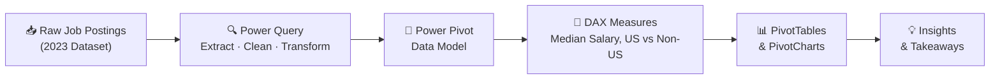

<div align="center">

# 📊 Data Science Job Market Analysis
### Excel-Powered Salary & Skills Intelligence Dashboard

*An end-to-end Excel analysis exploring salary trends, in-demand skills, and regional pay gaps across data science roles — built using real-world 2023 job posting data.*


</div>

---

## 🗂️ Table of Contents

- [Overview](#-overview)
- [Questions Analyzed](#-questions-analyzed)
- [Excel Skills Used](#️-excel-skills-used)
- [Dataset](#-dataset)
- [Analysis Breakdown](#-analysis-breakdown)
- [Workbook Structure](#-workbook-structure)
- [Key Takeaways](#-key-takeaways)
- [How to Use](#-how-to-use)
- [Author](#-author)
- [License](#-license)

---

## 📌 Overview

As someone who has navigated the data job market firsthand, I was struck by how little structured data existed to help job seekers understand **what skills to learn** and **what salary to expect**. This project fills that gap.

Using Excel's advanced features — Power Query, Power Pivot, DAX, and Pivot Charts — I analyzed thousands of real job postings to answer four practical questions every data professional should know.

<div align="center">

📁 **Dashboard File:** [`1_Project_Analysis.xlsx`](https://github.com/shadow-byte-warrior/Project_Analystics/blob/main/1_Project_Analysis.xlsx)

</div>

---

## ❓ Questions Analyzed

<div align="center">

| # | Question |
|:---:|---|
| 1️⃣ | Do more skills get you better pay? |
| 2️⃣ | What's the salary for data jobs in different regions? |
| 3️⃣ | What are the top skills of data professionals? |
| 4️⃣ | What's the pay for the top 10 skills? |

</div>

---

## 🛠️ Excel Skills Used

<div align="center">

| Skill | Purpose |
|:---:|---|
| 🔍 **Power Query (ETL)** | Extract, clean, and load job data from raw sources |
| 💪 **Power Pivot** | Build a relational data model across multiple tables |
| 🧮 **DAX** | Create custom measures like median salary calculations |
| 📊 **Pivot Tables** | Slice and dice data across roles, countries, and skills |
| 📈 **Pivot Charts** | Visualize salary vs. skills with combo charts |

</div>



---

## 📂 Dataset

Real-world data science job postings from **2023**, including:

| Field | Description |
|---|---|
| 👨‍💼 **Job Titles** | Data Analyst, Data Scientist, ML Engineer, Senior Data Engineer, etc. |
| 💰 **Salaries** | Annual average in USD |
| 📍 **Locations** | US vs. international breakdown |
| 🛠️ **Skills** | Required tools and technologies per role |

---

## 🔍 Analysis Breakdown

### 1️⃣ Do More Skills Get You Better Pay?
**Excel Skill: Power Query (ETL)**

#### Extract → Transform → Load

Using Power Query, I built two clean queries from the raw dataset:

- `data_jobs_all` — Job-level information (title, salary, country, schedule type)
- `data_job_skills` — Skill-level rows linked by `job_id`

| Step | Action |
|:---:|---|
| 📥 Extract | Pulled raw data from `data_salary_all.xlsx` |
| 🔄 Transform | Removed unnecessary columns, fixed types, trimmed whitespace, cleaned text |
| 🔗 Load | Loaded both tables into the workbook as structured, analysis-ready tables |

<div align="center">

**Applied Steps — `data_jobs_all`**

[](https://github.com/shadow-byte-warrior/Project_Analystics/blob/main/0_Resources/Images/2_Project_Analysis_Screenshot1.png)

**Applied Steps — `data_job_skills`**

[](https://github.com/shadow-byte-warrior/Project_Analystics/blob/main/0_Resources/Images/2_Project_Analysis_Screenshot2.png)

</div>

<table>
<tr>
<td width="50%" align="center"><b>Loaded Table — <code>data_jobs_all</code></b><br/><br/>
<a href="https://github.com/shadow-byte-warrior/Project_Analystics/blob/main/0_Resources/Images/2_Project_Analysis_Screenshot3.png"></a>
</td>
<td width="50%" align="center"><b>Loaded Table — <code>data_job_skills</code></b><br/><br/>
<a href="https://github.com/shadow-byte-warrior/Project_Analystics/blob/main/0_Resources/Images/2_Project_Analysis_Screenshot4.png"></a>
</td>
</tr>
</table>

#### 💡 Insight

<div align="center">

[](https://github.com/shadow-byte-warrior/Project_Analystics/blob/main/0_Resources/Images/2_Project_Analysis_Chart1.png)

</div>

There is a clear **positive correlation** between the number of skills requested in a job posting and its median salary. Senior Data Engineers (~8.2 skills, ~$150K) and Data Engineers (~7 skills, ~$130K) sit at the top. Business Analysts (~3.3 skills, ~$85K) and Data Analysts (~3.7 skills, ~$90K) are at the lower end.

> 🎯 **Takeaway:** Every additional relevant skill you build is a measurable lever for higher pay — especially for those targeting Senior or Engineering roles.

---

### 2️⃣ What's the Salary for Data Jobs in Different Regions?
**Excel Skills: PivotTables + DAX**

I created a PivotTable using the Power Pivot data model, then wrote custom DAX measures to compare **US vs. Non-US** median salaries side by side:

```dax
-- Overall Median Salary
Median Salary := MEDIAN(data_jobs_all[salary_year_avg])

-- US-Only Median Salary
US Median Salary :=
CALCULATE(
    MEDIAN(data_jobs_all[salary_year_avg]),
    data_jobs_all[job_country] = "United States"
)
```

#### 💡 Insight

<div align="center">

[](https://github.com/shadow-byte-warrior/Project_Analystics/blob/main/0_Resources/Images/2_Project_Analysis_Chart2.png)

</div>

| Role | US Median | Non-US Median | US Premium |
|---|---:|---:|---:|
| Senior Data Engineer | $150,000 | $147,500 | +$2.5K |
| Machine Learning Engineer | $150,000 | $101,029 | 🔥 +$48.9K |
| Software Engineer | $125,000 | $89,100 | 🔥 +$35.9K |
| Data Engineer | $125,000 | $123,500 | +$1.5K |
| Data Scientist | $130,000 | $119,550 | +$10.5K |
| Data Analyst | $90,000 | $90,000 | — |
| Business Analyst | $90,000 | $75,000 | +$15K |

The US premium is largest for Software Engineers (+$35.9K) and ML Engineers (+$48.9K). Senior Data Engineer salaries are globally competitive — showing strong international demand for that role.

> 🎯 **Takeaway:** Geography plays a significant role in compensation for most roles. For remote job seekers, targeting US-based companies can be a major salary multiplier.

---

### 3️⃣ What Are the Top Skills of Data Professionals?
**Excel Skill: Power Pivot (Data Modeling)**

I built a data model in Power Pivot linking `data_jobs_all` and `data_jobs_skill` via the `job_id` foreign key — a **one-to-many** relationship that enables cross-table analysis without VLOOKUP.

<div align="center">

**Data Model Relationship**

[](https://github.com/shadow-byte-warrior/Project_Analystics/blob/main/0_Resources/Images/2_Project_Analysis_Screenshot5.png)

**Loaded Data in Power Pivot**

[](https://github.com/shadow-byte-warrior/Project_Analystics/blob/main/0_Resources/Images/2_Project_Analysis_Screenshot6.png)

</div>

#### 💡 Insight

<div align="center">

[](https://github.com/shadow-byte-warrior/Project_Analystics/blob/main/0_Resources/Images/2_Project_Analysis_Chart3.png)

</div>

| Rank | Skill | Likelihood |
|:---:|---|---|
| 1 | 🐘 SQL | `███████░` ~70% |
| 2 | 🐍 Python | `██████░░` ~65% |
| 3 | ☁️ AWS | `████░░░░` ~43% |
| 4 | ⚡ Spark | `███░░░░░` ~32% |
| 5 | ☁️ Azure | `███░░░░░` ~31% |
| 6 | ❄️ Snowflake | `██░░░░░░` ~25% |
| 7 | ☕ Java | `██░░░░░░` ~23% |
| 8 | 🐘 Hadoop | `██░░░░░░` ~18% |
| 9 | 📨 Kafka | `█░░░░░░░` ~17% |
| 10 | 🗄️ NoSQL | `█░░░░░░░` ~16% |

> 🎯 **Takeaway:** SQL + Python is the non-negotiable foundation. Cloud platforms (AWS, Azure) and big data tools (Spark, Kafka) are the next layer that separates competitive candidates.

---

### 4️⃣ What's the Pay for the Top 10 Skills?
**Excel Skill: Advanced Combo PivotChart**

I created a combo PivotChart plotting:

- 🟦 **Primary Axis:** Median Salary (clustered column)
- 💠 **Secondary Axis:** Skill Likelihood % (line with diamond markers)

This dual-axis view shows both *how much a skill pays* and *how commonly it's requested* — two very different signals.

#### 💡 Insight

<div align="center">

[](https://github.com/shadow-byte-warrior/Project_Analystics/blob/main/0_Resources/Images/2_Project_Analysis_Chart4.png)

</div>

| Skill | Median Salary | Likelihood |
|---|---:|---:|
| 🐍 Python | ~$98K | ~30% |
| 🗄️ Oracle | ~$95K | ~7% |
| 📊 Tableau | ~$95K | ~29% |
| 📈 R | ~$93K | ~17% |
| 🐘 SQL | ~$93K | ~53% |
| 📊 Power BI | ~$90K | ~18% |
| 📉 SAS | ~$90K | ~19% |
| 📽️ PowerPoint | ~$85K | ~9% |
| 📗 Excel | ~$85K | ~41% |
| 📝 Word | ~$82K | ~9% |

SQL is unique — it has the highest likelihood (~53%) **and** strong salary (~$93K), making it the single best investment. Python pays the most while remaining highly in demand. PowerPoint and Word trail both in pay and prevalence.

> 🎯 **Takeaway:** SQL and Python offer the best combination of high pay and high demand. Niche tools like Oracle pay well but appear in fewer postings — useful for specialization after mastering the core stack.

---

## 📋 Workbook Structure

| Sheet | Contents |
|---|---|
| `Salary_Vs_Skills` | Scatter plot — skills count vs. median salary by role |
| `Salary_Analysis` | PivotTable — US vs. Non-US salary comparison with DAX |
| `Skill_Job_Analysis` | Bar chart — top 10 skills by job posting likelihood |
| `Skill_Salary_Analysis` | Combo chart — median salary + likelihood for top 10 skills |

---

## 💡 Key Takeaways

> 📈 **More skills = more pay** — Senior Data Engineer tops both axes: most skills, highest salary
>
> 🌍 **US roles pay a premium** — especially for ML Engineers (+$49K) and Software Engineers (+$36K)
>
> 💻 **SQL is king** — highest demand (~70%) with strong pay (~$93K median)
>
> 🐍 **Python pays the most** — among top 10 skills, Python leads at ~$98K median
>
> ☁️ **Cloud is rising** — AWS, Azure, and Spark appear in 30–43% of postings
>
> 📉 **Office tools don't pay** — PowerPoint and Word rank last in both salary and demand

---

## 🚀 How to Use

1. Download [`1_Project_Analysis.xlsx`](https://github.com/shadow-byte-warrior/Project_Analystics/blob/main/1_Project_Analysis.xlsx)
2. Open in **Microsoft Excel 2019+** (required for Power Query & Power Pivot)
3. Navigate between the **4 analysis sheets** using the bottom tabs
4. Interact with PivotTable filters (country slicer, role dropdown) to explore the data

---

## 👤 Author

<div align="center">

**Arun Pandian**
AI & Data Science Graduate | Aspiring Data Analyst
📍 Coimbatore, Tamil Nadu, India

[](https://linkedin.com/in/arunpandiansh2030)
[](https://github.com/shadow-byte-warrior)

</div>

---

## 📄 License

Open for educational and portfolio reference. Dataset sourced from real-world 2023 data science job postings.

<div align="center">

⭐ If this project helped you understand the data job market, consider giving it a star!

</div>
