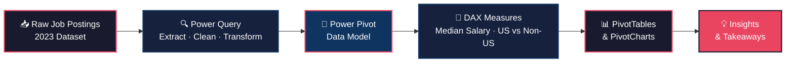

<!-- ══════════════════════ HERO BANNER (reliable sources only) ══════════════════════ -->
<div align="center">


# 📊 Excel-Powered Salary & Skills Intelligence Dashboard

<!-- ══════════════════════ TYPING ANIMATION ══════════════════════ -->


<br/><br/>

<!-- ══════════════════════ STATUS BADGES (shields.io — always works) ══════════════════════ -->


<br/><br/>


<br/>


<br/><br/>

> ### *"Turning thousands of raw job postings into four career-defining answers — powered entirely by Excel."*

<br/>

<a href="https://github.com/shadow-byte-warrior/Project_Analystics/blob/main/1_Project_Analysis.xlsx">

</a>
&nbsp;
<a href="https://github.com/shadow-byte-warrior/Project_Analystics">

</a>

</div>

<br/>


<!-- ══════════════════════ KPI COMMAND CENTER ══════════════════════ -->
<div align="center">

## 🎛️ KPI COMMAND CENTER

<table>
<tr>
<td align="center" width="25%">
💼<br/>
<b>TOP PAYING ROLE</b><br/><br/>

</td>
<td align="center" width="25%">
🔥<br/>
<b>BIGGEST US PREMIUM</b><br/><br/>

</td>
<td align="center" width="25%">
🐘<br/>
<b>#1 IN-DEMAND SKILL</b><br/><br/>

</td>
<td align="center" width="25%">
🐍<br/>
<b>HIGHEST-PAYING SKILL</b><br/><br/>

</td>
</tr>
</table>

</div>


<!-- ══════════════════════ NAVIGATION ══════════════════════ -->
<div align="center">

## 🗂️ DASHBOARD NAVIGATION

<table>
<tr>
<td align="center" width="16%"><a href="#-mission-briefing">🎯<br/><b>Mission<br/>Briefing</b></a></td>
<td align="center" width="16%"><a href="#-the-four-questions">❓<br/><b>Four<br/>Questions</b></a></td>
<td align="center" width="16%"><a href="#️-tech-stack--pipeline">🛠️<br/><b>Tech<br/>Stack</b></a></td>
<td align="center" width="16%"><a href="#-panel-01--skills-vs-pay">📊<br/><b>Analysis<br/>Panels</b></a></td>
<td align="center" width="16%"><a href="#-key-takeaways-board">💡<br/><b>Takeaways<br/>Board</b></a></td>
<td align="center" width="16%"><a href="#-connect-with-me">🤝<br/><b>Connect</b></a></td>
</tr>
</table>

</div>

---

## 🎯 Mission Briefing

As someone who's navigated the data job market firsthand, I noticed a gap: very little structured data exists to help job seekers know **what skills to learn** and **what salary to realistically expect**.

This dashboard closes that gap — turning thousands of raw **2023 job postings** into four decision-ready answers using nothing but Excel's advanced analytics toolkit.

<div align="center">

### ⚙️ ANALYTICS PIPELINE


```mermaid
flowchart LR
    A["📥 Raw Job Postings<br/>2023 Dataset"] --> B["🔍 Power Query<br/>Extract · Clean · Transform"]
    B --> C["💪 Power Pivot<br/>Data Model"]
    C --> D["🧮 DAX Measures<br/>Median Salary · US vs Non-US"]
    D --> E["📊 PivotTables<br/>& PivotCharts"]
    E --> F["💡 Insights<br/>& Takeaways"]

    style A fill:#1a1a2e,stroke:#e94560,stroke-width:2px,color:#fff
    style B fill:#16213e,stroke:#0f3460,stroke-width:2px,color:#fff
    style C fill:#0f3460,stroke:#e94560,stroke-width:2px,color:#fff
    style D fill:#16213e,stroke:#0f3460,stroke-width:2px,color:#fff
    style E fill:#1a1a2e,stroke:#e94560,stroke-width:2px,color:#fff
    style F fill:#e94560,stroke:#1a1a2e,stroke-width:2px,color:#fff
```

</div>

<details>
<summary><b>📂 &nbsp;ABOUT THE DATASET — click to expand</b></summary>
<br/>

Real-world data science job postings from **2023**, including:

| | Field | Description |
|:---:|---|---|
| 👨‍💼 | **Job Titles** | Data Analyst, Data Scientist, ML Engineer, Senior Data Engineer, etc. |
| 💰 | **Salaries** | Annual average in USD |
| 📍 | **Locations** | US vs. international breakdown |
| 🛠️ | **Skills** | Required tools and technologies per role |

</details>

---

## ❓ The Four Questions

<div align="center">

| # | Question | Jump To |
|:---:|---|:---:|
| 1️⃣ | **Do more skills get you better pay?** | [`→ PANEL 01`](#-panel-01--skills-vs-pay) |
| 2️⃣ | **What's the salary for data jobs across regions?** | [`→ PANEL 02`](#-panel-02--regional-salary-radar) |
| 3️⃣ | **What are the top skills of data professionals?** | [`→ PANEL 03`](#-panel-03--skill-leaderboard) |
| 4️⃣ | **What's the pay for the top 10 skills?** | [`→ PANEL 04`](#-panel-04--pay-vs-demand-matrix) |

</div>

---

## 🛠️ Tech Stack & Pipeline

<div align="center">

| | Tool | Purpose |
|:---:|:---|:---|
| 🔍 | **Power Query (ETL)** | Extract, clean, and load job data from raw sources |
| 💪 | **Power Pivot** | Build a relational data model across multiple tables |
| 🧮 | **DAX** | Custom measures — median salary, US vs. Non-US splits |
| 📊 | **PivotTables** | Slice and dice data across roles, countries, and skills |
| 📈 | **PivotCharts** | Combo visualizations — salary vs. skills, dual-axis views |

</div>


<!-- ══════════════════════ PANEL 01 ══════════════════════ -->
<div align="center">

## 📊 PANEL 01 — Skills vs. Pay


</div>

<details>
<summary><b>🔍 &nbsp;EXTRACT → TRANSFORM → LOAD — view the ETL process</b></summary>
<br/>

Two clean queries were built from the raw dataset:

- `data_jobs_all` — job-level info (title, salary, country, schedule type)
- `data_job_skills` — skill-level rows linked by `job_id`

| Step | Action |
|:---:|---|
| 📥 **Extract** | Pulled raw data from `data_salary_all.xlsx` |
| 🔄 **Transform** | Removed unnecessary columns, fixed types, trimmed whitespace, cleaned text |
| 🔗 **Load** | Loaded both tables as structured, analysis-ready tables |

<table>
<tr>
<td width="50%" align="center"><b>Applied Steps — <code>data_jobs_all</code></b><br/><br/>
<a href="https://github.com/shadow-byte-warrior/Project_Analystics/blob/main/0_Resources/Images/2_Project_Analysis_Screenshot1.png"></a>
</td>
<td width="50%" align="center"><b>Applied Steps — <code>data_job_skills</code></b><br/><br/>
<a href="https://github.com/shadow-byte-warrior/Project_Analystics/blob/main/0_Resources/Images/2_Project_Analysis_Screenshot2.png"></a>
</td>
</tr>
<tr>
<td width="50%" align="center"><b>Loaded Table — <code>data_jobs_all</code></b><br/><br/>
<a href="https://github.com/shadow-byte-warrior/Project_Analystics/blob/main/0_Resources/Images/2_Project_Analysis_Screenshot3.png"></a>
</td>
<td width="50%" align="center"><b>Loaded Table — <code>data_job_skills</code></b><br/><br/>
<a href="https://github.com/shadow-byte-warrior/Project_Analystics/blob/main/0_Resources/Images/2_Project_Analysis_Screenshot4.png"></a>
</td>
</tr>
</table>
</details>

<br/>

<div align="center">

<a href="https://github.com/shadow-byte-warrior/Project_Analystics/blob/main/0_Resources/Images/2_Project_Analysis_Chart1.png">

</a>

</div>

<table>
<tr>
<td>

> ### 💡 INSIGHT
> There's a clear **positive correlation** between the number of skills a posting requires and its median salary. **Senior Data Engineers** (~8.2 skills, ~$150K) and **Data Engineers** (~7 skills, ~$130K) top the chart, while **Business Analysts** (~3.3 skills, ~$85K) and **Data Analysts** (~3.7 skills, ~$90K) sit lower.
>
> 🎯 **TAKEAWAY:** Every additional relevant skill is a measurable lever for higher pay — especially on the Senior / Engineering track.

</td>
</tr>
</table>

<div align="right"><a href="#️-dashboard-navigation"></a></div>

---

<!-- ══════════════════════ PANEL 02 ══════════════════════ -->
<div align="center">

## 🌍 PANEL 02 — Regional Salary Radar


</div>

<br/>

A PivotTable built on the Power Pivot data model, driven by custom DAX measures comparing **US vs. Non-US** medians:

```dax
-- Overall Median Salary
Median Salary := MEDIAN(data_jobs_all[salary_year_avg])

-- US-Only Median Salary
US Median Salary :=
CALCULATE(
    MEDIAN(data_jobs_all[salary_year_avg]),
    data_jobs_all[job_country] = "United States"
)
```

<div align="center">

<a href="https://github.com/shadow-byte-warrior/Project_Analystics/blob/main/0_Resources/Images/2_Project_Analysis_Chart2.png">

</a>

<br/><br/>

| Role | 🇺🇸 US Median | 🌍 Non-US Median | US Premium |
|---|---:|---:|:---:|
| Senior Data Engineer | **$150,000** | $147,500 | `+$2.5K` |
| Machine Learning Engineer | **$150,000** | $101,029 | 🔥 `+$48.9K` |
| Software Engineer | **$125,000** | $89,100 | 🔥 `+$35.9K` |
| Data Engineer | **$125,000** | $123,500 | `+$1.5K` |
| Data Scientist | **$130,000** | $119,550 | `+$10.5K` |
| Data Analyst | **$90,000** | $90,000 | `—` |
| Business Analyst | **$90,000** | $75,000 | `+$15K` |

</div>

<table>
<tr>
<td>

> ### 💡 INSIGHT
> The US premium is largest for **Software Engineers** (+$35.9K) and **ML Engineers** (+$48.9K). Senior Data Engineer pay is globally competitive — a signal of strong international demand for that role.
>
> 🎯 **TAKEAWAY:** Geography materially affects compensation. Remote job seekers targeting US-based companies can unlock a major salary multiplier.

</td>
</tr>
</table>

<div align="right"><a href="#️-dashboard-navigation"></a></div>

---

<!-- ══════════════════════ PANEL 03 ══════════════════════ -->
<div align="center">

## 🏆 PANEL 03 — Skill Leaderboard


</div>

<br/>

A data model links `data_jobs_all` and `data_jobs_skill` via the `job_id` foreign key — a **one-to-many** relationship enabling cross-table analysis without VLOOKUP.

<details>
<summary><b>🔗 &nbsp;VIEW DATA MODEL & LOADED TABLES</b></summary>
<br/>

<div align="center">

**Data Model Relationship**

<a href="https://github.com/shadow-byte-warrior/Project_Analystics/blob/main/0_Resources/Images/2_Project_Analysis_Screenshot5.png">

</a>

**Loaded Data in Power Pivot**

<a href="https://github.com/shadow-byte-warrior/Project_Analystics/blob/main/0_Resources/Images/2_Project_Analysis_Screenshot6.png">

</a>

</div>
</details>

<br/>

<div align="center">

<a href="https://github.com/shadow-byte-warrior/Project_Analystics/blob/main/0_Resources/Images/2_Project_Analysis_Chart3.png">

</a>

<br/><br/>

### 🎖️ TOP 10 SKILL RANKINGS

| Rank | Skill | Demand Meter | Likelihood |
|:---:|---|---|:---:|
| 🥇 | 🐘 **SQL** | `██████████████░░░░░░` | **~70%** |
| 🥈 | 🐍 **Python** | `█████████████░░░░░░░` | **~65%** |
| 🥉 | ☁️ **AWS** | `█████████░░░░░░░░░░░` | **~43%** |
| 4 | ⚡ **Spark** | `██████░░░░░░░░░░░░░░` | ~32% |
| 5 | ☁️ **Azure** | `██████░░░░░░░░░░░░░░` | ~31% |
| 6 | ❄️ **Snowflake** | `█████░░░░░░░░░░░░░░░` | ~25% |
| 7 | ☕ **Java** | `█████░░░░░░░░░░░░░░░` | ~23% |
| 8 | 🐘 **Hadoop** | `████░░░░░░░░░░░░░░░░` | ~18% |
| 9 | 📨 **Kafka** | `███░░░░░░░░░░░░░░░░░` | ~17% |
| 10 | 🗄️ **NoSQL** | `███░░░░░░░░░░░░░░░░░` | ~16% |

</div>

<table>
<tr>
<td>

> ### 💡 INSIGHT
> **SQL + Python** form the non-negotiable foundation. Cloud platforms (AWS, Azure) and big data tools (Spark, Kafka) are the next layer separating competitive candidates.
>
> 🎯 **TAKEAWAY:** Master SQL and Python first — then layer in one cloud platform and one big-data tool to stand out.

</td>
</tr>
</table>

<div align="right"><a href="#️-dashboard-navigation"></a></div>

---

<!-- ══════════════════════ PANEL 04 ══════════════════════ -->
<div align="center">

## 💰 PANEL 04 — Pay vs. Demand Matrix


</div>

<br/>

A combo PivotChart plotting two signals on one canvas:

<div align="center">

| Axis | Metric | Chart Type |
|:---:|---|---|
| 🟦 **Primary** | Median Salary | Clustered Column |
| 💠 **Secondary** | Skill Likelihood % | Line + Diamond Markers |

</div>

This dual-axis view separates *how much a skill pays* from *how often it's requested* — two very different signals.

<div align="center">

<a href="https://github.com/shadow-byte-warrior/Project_Analystics/blob/main/0_Resources/Images/2_Project_Analysis_Chart4.png">

</a>

<br/><br/>

| Skill | Median Salary | Likelihood | Verdict |
|---|---:|---:|:---:|
| 🐍 **Python** | ~$98K | ~30% | 💎 Best Pay |
| 🗄️ Oracle | ~$95K | ~7% | 🎯 Niche |
| 📊 Tableau | ~$95K | ~29% | ⭐ Strong |
| 📈 R | ~$93K | ~17% | ⭐ Strong |
| 🐘 **SQL** | ~$93K | ~53% | 👑 Best Overall |
| 📊 Power BI | ~$90K | ~18% | ⭐ Strong |
| 📉 SAS | ~$90K | ~19% | ⭐ Strong |
| 📽️ PowerPoint | ~$85K | ~9% | ⬇️ Weak |
| 📗 Excel | ~$85K | ~41% | ✅ Common |
| 📝 Word | ~$82K | ~9% | ⬇️ Weak |

</div>

<table>
<tr>
<td>

> ### 💡 INSIGHT
> **SQL is unique** — highest likelihood (~53%) **and** strong salary (~$93K), making it the single best investment. **Python** pays the most while staying highly in demand. PowerPoint and Word trail on both fronts.
>
> 🎯 **TAKEAWAY:** SQL and Python offer the best pay-to-demand ratio. Niche tools like Oracle pay well but appear less often — good for specialization *after* the core stack.

</td>
</tr>
</table>

<div align="right"><a href="#️-dashboard-navigation"></a></div>


<!-- ══════════════════════ WORKBOOK STRUCTURE ══════════════════════ -->
<div align="center">

## 📋 Workbook Structure

| | Sheet | Contents |
|:---:|---|---|
| 📉 | `Salary_Vs_Skills` | Scatter plot — skills count vs. median salary by role |
| 📊 | `Salary_Analysis` | PivotTable — US vs. Non-US salary comparison with DAX |
| 📈 | `Skill_Job_Analysis` | Bar chart — top 10 skills by job posting likelihood |
| 💹 | `Skill_Salary_Analysis` | Combo chart — median salary + likelihood for top 10 skills |

</div>

---

<!-- ══════════════════════ TAKEAWAYS BOARD ══════════════════════ -->
<div align="center">

## 💡 KEY TAKEAWAYS BOARD

<table>
<tr>
<td align="center" width="33%">
📈<br/>
<b>MORE SKILLS = MORE PAY</b><br/>
<sub>Senior Data Engineer tops both axes — most skills, highest salary</sub>
</td>
<td align="center" width="33%">
🌍<br/>
<b>US ROLES PAY A PREMIUM</b><br/>
<sub>Especially ML Engineers (+$49K) & Software Engineers (+$36K)</sub>
</td>
<td align="center" width="33%">
👑<br/>
<b>SQL IS KING</b><br/>
<sub>~70% demand with a strong ~$93K median</sub>
</td>
</tr>
<tr>
<td align="center">
🐍<br/>
<b>PYTHON PAYS THE MOST</b><br/>
<sub>~$98K median — highest among top 10 skills</sub>
</td>
<td align="center">
☁️<br/>
<b>CLOUD IS RISING</b><br/>
<sub>AWS, Azure & Spark appear in 30–43% of postings</sub>
</td>
<td align="center">
📉<br/>
<b>OFFICE TOOLS DON'T PAY</b><br/>
<sub>PowerPoint & Word rank last in both salary and demand</sub>
</td>
</tr>
</table>

</div>

---

<!-- ══════════════════════ HOW TO USE ══════════════════════ -->
## 🚀 How to Use

<div align="center">

| Step | Action |
|:---:|---|
| **1️⃣** | Download [`1_Project_Analysis.xlsx`](https://github.com/shadow-byte-warrior/Project_Analystics/blob/main/1_Project_Analysis.xlsx) |
| **2️⃣** | Open in **Microsoft Excel 2019+** (required for Power Query & Power Pivot) |
| **3️⃣** | Navigate the **4 analysis sheets** via the bottom tabs |
| **4️⃣** | Use PivotTable filters (country slicer, role dropdown) to explore live |

</div>

---

<!-- ══════════════════════ AUTHOR / CONNECT ══════════════════════ -->
<div align="center">

## 🤝 Connect With Me

### **Arun Pandian**
**AI & Data Science Graduate · Aspiring Data Analyst**
📍 Coimbatore, Tamil Nadu, India

<br/>

<a href="https://linkedin.com/in/arunpandiansh2030">

</a>
<a href="https://github.com/shadow-byte-warrior">

</a>

<br/><br/>

### 📄 License
Open for educational and portfolio reference. Dataset sourced from real-world 2023 data science job postings.

<br/>

⭐ **If this dashboard helped you understand the data job market, consider giving it a star!** ⭐

<br/>

<!-- ══════════════════════ FOOTER WAVE ══════════════════════ -->


</div>
